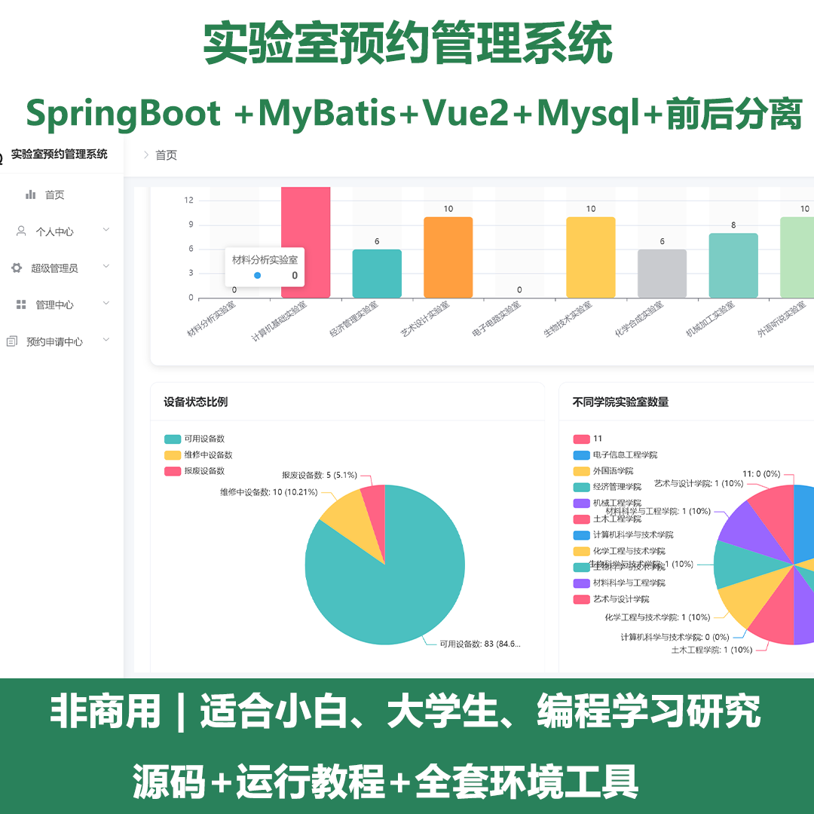
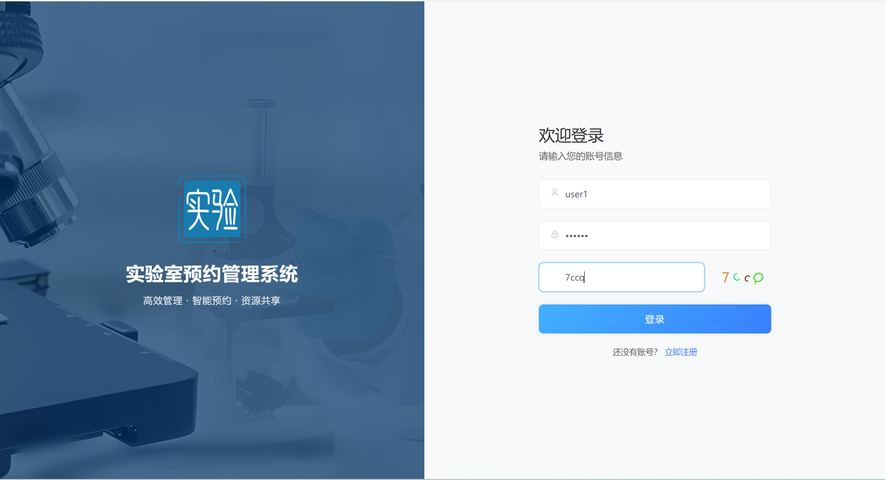
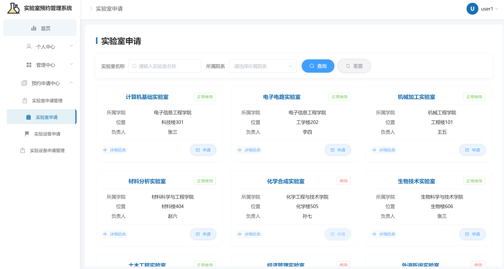
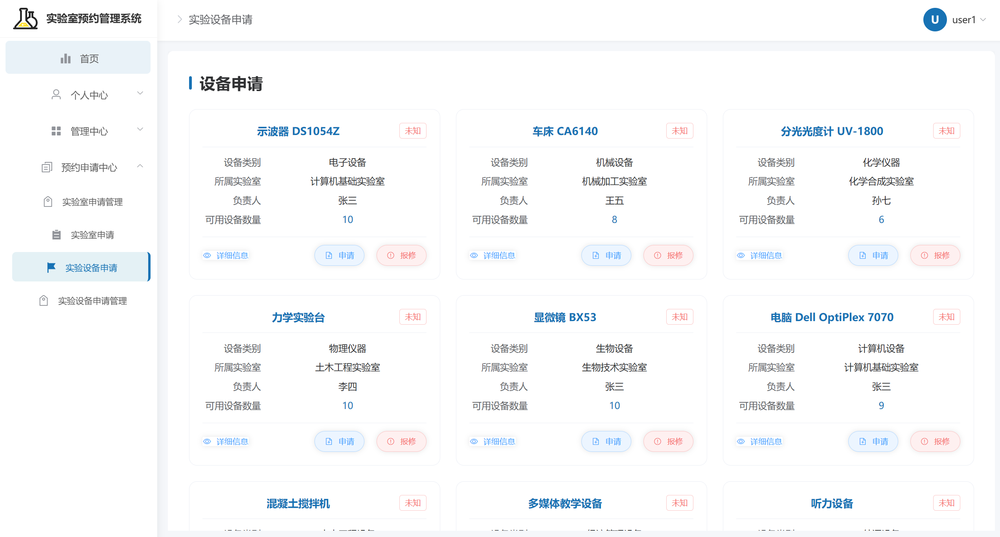
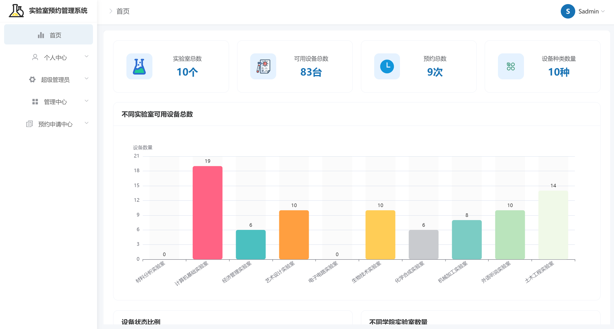
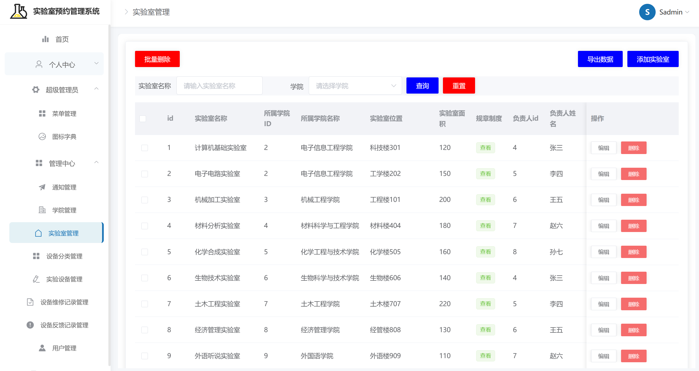
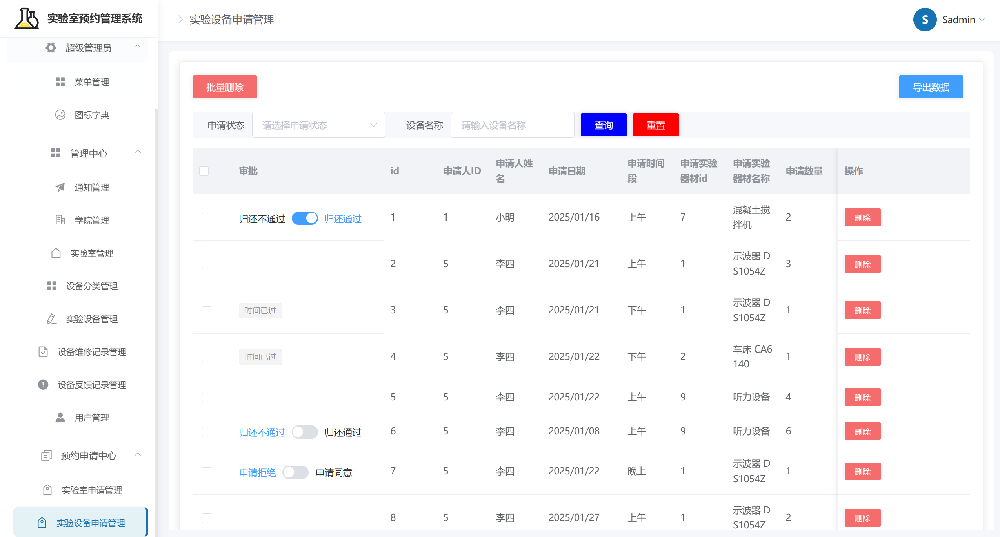
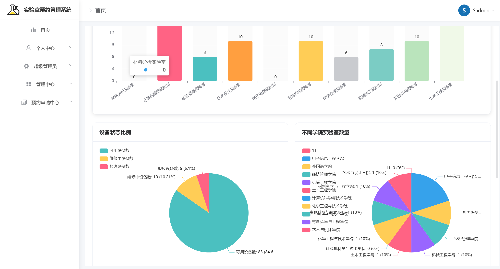
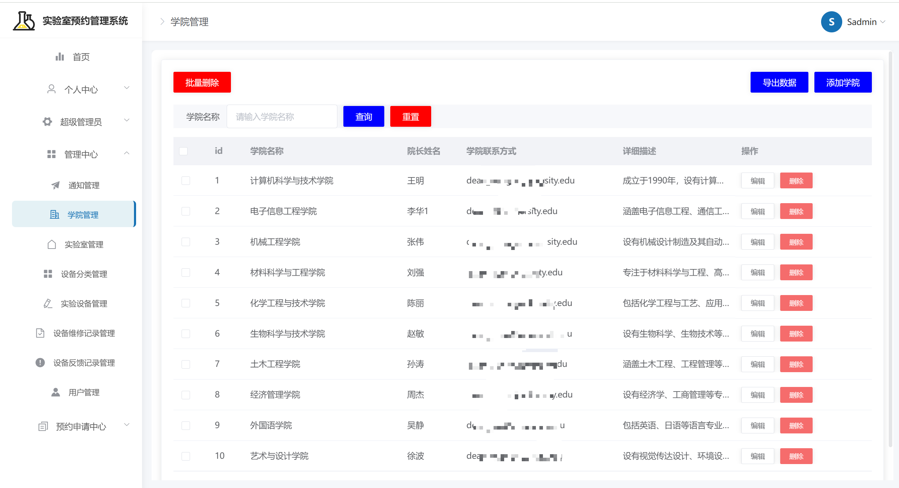

# springbootA534
springbootA534实验室预约管理系统
 
## 查看主页获取源码

### 一、关键词

实验室预约管理系统，实验室预约系统

### 二、作品包含

源码+数据库+全套环境和工具资源+部署教程

### 三、项目技术

前端技术：Vue2 + ElementUI+ Axios 
数据库：MySQL
后端技术：Java、SpringBoot + MyBatis

  

### 四、运行环境(以下版本亲测，其他版本未知，请自测)

开发工具：IDEA/eclipse  + vscode

数据库：MySQL8 

数据库管理工具：Navicat10以上版本

环境配置软件： JDK17 + Maven3.6.3

前端Nodejs：16

浏览器：谷歌浏览器

### 五、项目介绍

项目编号：springbootA534

实验室预约管理系统是一种针对学校、科研机构等场所的实验室资源，进行信息化管理的软件系统。它旨在优化实验室资源配置，提高使用效率，方便师生和科研人员预约、使用实验室 ，同时减轻管理人员的工作负担。以下是其主要功能模块及特点：

系统主要功能总结
1. 用户管理功能
支持多角色系统：超级管理员、管理员、和实验者用户注册与登录功能
个人信息管理和密码修改
用户审核机制
2. 实验室管理功能
实验室信息的增删改查
开放状态管理、实验室与学院关联管理
实验室规章制度管理
3. 实验设备管理功能
设备分类管理
设备信息管理(增删改查)
设备状态和数量跟踪
设备维修记录管理
4. 申请及预约系统
实验室申请预约功能
设备借用申请功能
申请审批流程管理
设备归还流程管理
5. 维护和反馈系统
设备故障报告功能
设备维修流程管理
设备使用反馈功能
反馈处理和回复功能
6. 通知管理功能
系统公告发布
通知查看功能
7. 学院信息管理功能学院与实验室关联
8. 系统管理功能：菜单管理、图标管理、权限控制

### 六、运行截图

